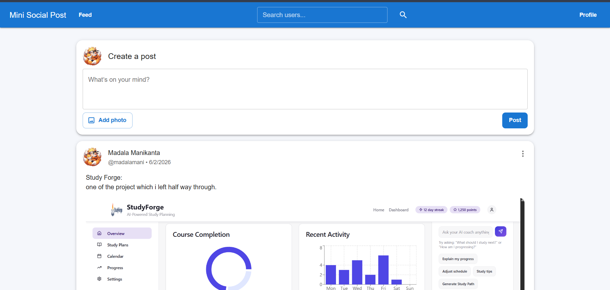
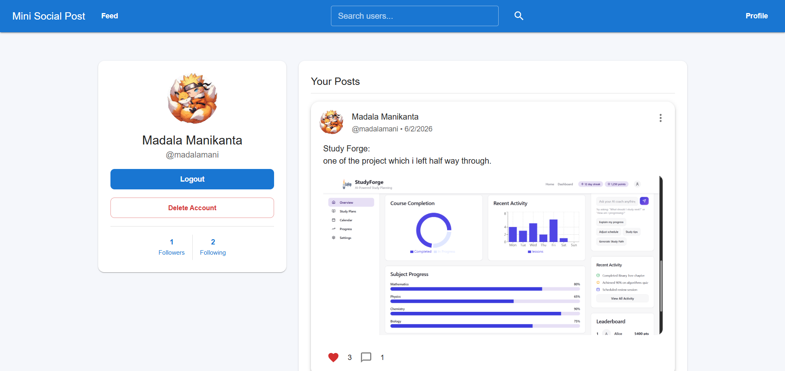
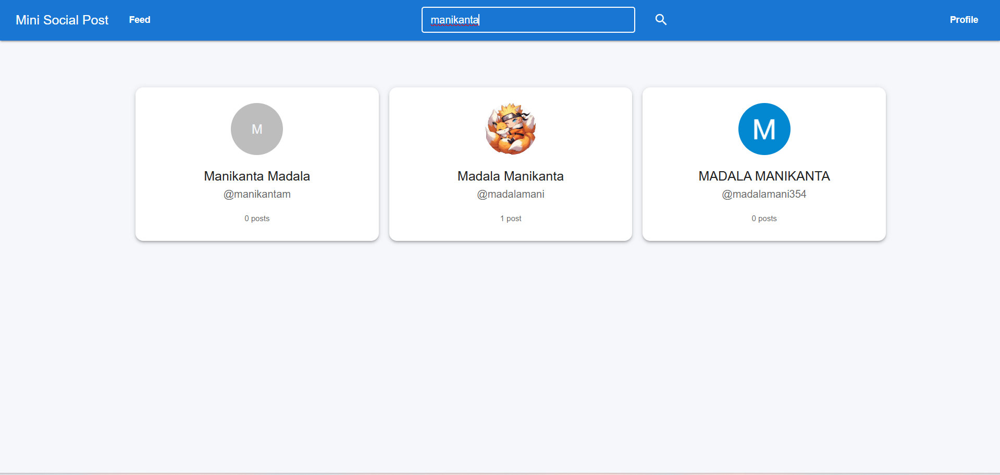
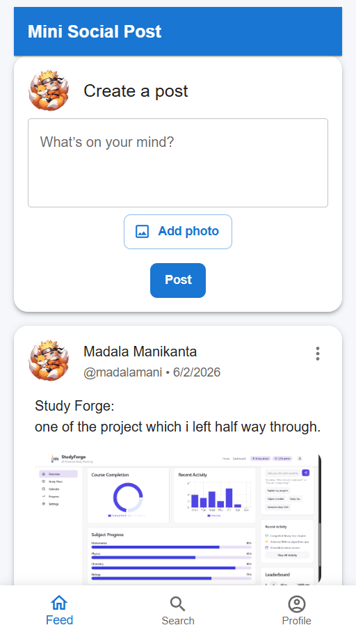
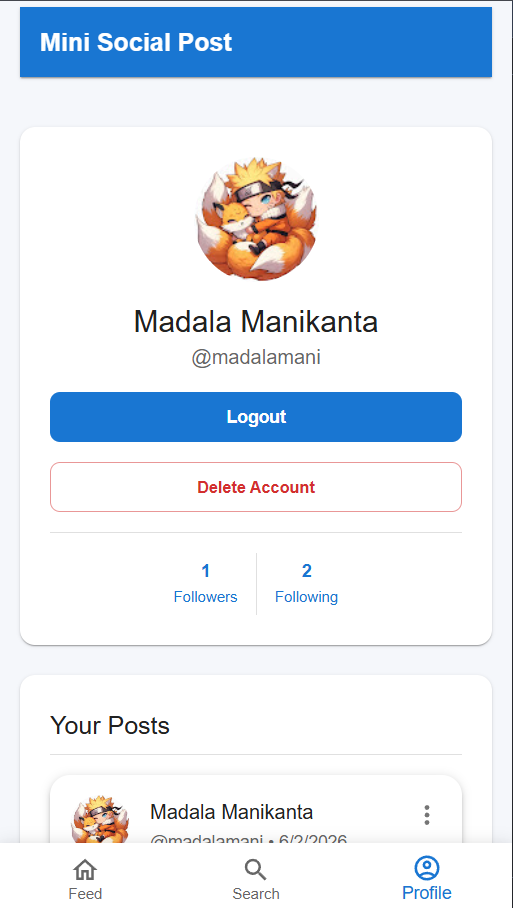
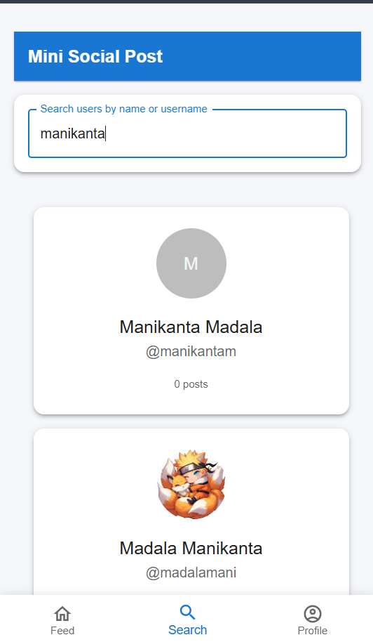

# Mini Social Post Application

A full-stack social networking platform inspired by TaskPlanet Social Feed.

## Live Demo

Frontend: https://mini-social-post-application-one.vercel.app/

Backend API: https://mini-social-post-application-ug33.onrender.com/

A lightweight full-stack social posting app (React + Node/Express + MongoDB) featuring user authentication, Google sign-in via Firebase, image uploading, and basic social interactions (posts, comments, follow system).

---

## Project Overview

Mini Social Post Application is a full-stack social networking platform inspired by the TaskPlanet Social Feed.

Users can:
- Create accounts using Email/Password or Google Sign-In
- Create text and image posts
- Like and comment on posts
- Search and follow other users
- Manage profiles and uploaded content

The application is built using React, Node.js, Express, MongoDB Atlas, Firebase Authentication, and Cloudinary.

This project was developed as part of the 3W Full Stack Internship Assignment.

- `backend/` — Node.js + Express API and MongoDB models.
- `frontend/` — React (Vite) single-page application that uses Firebase for Google authentication.

## Features

### Authentication
- Email & Password Signup/Login
- Google Authentication using Firebase
- JWT-based Authentication
- Protected Routes

### Social Features
- Create Text Posts
- Create Image Posts
- Edit Posts
- Delete Posts
- Like / Unlike Posts
- Comment on Posts
- Real-time Interaction Updates

### User Features
- User Profiles
- Edit Profile
- Search Users
- Follow / Unfollow Users
- Followers & Following Lists

### Media
- Image Upload Support
- Cloudinary Integration
- Responsive Image Display

### Responsive Design
- Mobile Friendly
- Tablet Friendly
- Desktop Friendly

## Architecture

Frontend (React + MUI)
        ↓
REST API (Express.js)
        ↓
MongoDB Atlas

Authentication:
Firebase Google Auth
        ↓
Backend JWT
        ↓
Protected API Routes

## Tech Stack

- Frontend: React, Vite, React Router, MUI
- Auth & Identity: Firebase (Google sign-in) + JWT (backend)
- Backend: Node.js, Express, MongoDB (Mongoose)
- File storage: Cloudinary
- Misc: Axios, Multer, bcryptjs, jsonwebtoken

## Installation

1. Clone the repo:

```bash
git clone <repo-url>
cd mini-social-post-application
```

2. Install dependencies for both projects:

```bash
# Backend
cd backend
npm install

# In a separate terminal: Frontend
cd ../frontend
npm install
```

## Environment variables

Create a `.env` file inside `backend/` and a `.env` (or `.env.local`) in `frontend/` (Vite expects `VITE_` prefixes for client-side env vars).

Backend (example `backend/.env`):

```
PORT=5000
MONGO_URI=your_mongodb_connection_string
JWT_SECRET=your_jwt_secret
CLOUDINARY_CLOUD_NAME=your_cloud_name
CLOUDINARY_API_KEY=your_cloudinary_api_key
CLOUDINARY_API_SECRET=your_cloudinary_api_secret
# Optional: allow CORS origins or other flags
```

Frontend (example `frontend/.env`):

```
VITE_API_URL=http://localhost:5000/api
VITE_FIREBASE_API_KEY=your_firebase_api_key
VITE_FIREBASE_AUTH_DOMAIN=your_project.firebaseapp.com
VITE_FIREBASE_PROJECT_ID=your_project_id
VITE_FIREBASE_STORAGE_BUCKET=your_project.appspot.com
VITE_FIREBASE_MESSAGING_SENDER_ID=your_sender_id
VITE_FIREBASE_APP_ID=your_app_id
```

Notes:
- Keep secret keys out of source control. Use a secrets manager or environment configuration for production.
- `VITE_` prefixed variables are embedded into the client bundle and must not include any sensitive server-only secrets.

## Running the Frontend

From the `frontend/` folder:

```bash
npm run dev
```

This starts the Vite dev server (default port 5173). The frontend expects the backend base URL at `VITE_API_URL`.

To build for production:

```bash
npm run build
npm run preview
```

## Running the Backend

From the `backend/` folder:

```bash
# development with auto-reload
npm run dev

# or start production server
npm start
```

By default the backend listens on port `5000` (configurable via `PORT` env var). The API root is `/api` (e.g. `http://localhost:5000/api`).

## Google Authentication Setup

This project uses Firebase on the frontend to handle Google sign-in and then sends a small user payload to the backend to create or authenticate the user and return a JWT.

Steps to enable Google sign-in:

1. Create a Firebase project at https://console.firebase.google.com/.
2. In the Firebase console, enable **Authentication → Sign-in method → Google**.
3. Register a Web app in Firebase to obtain the configuration values (`apiKey`, `authDomain`, etc.). Add those to `frontend/.env` using the `VITE_FIREBASE_...` variables listed above.
4. In the frontend, Google sign-in uses Firebase to obtain the authenticated user info. The client then posts a payload containing at least `name` and `email` (and optionally `avatar`) to the backend endpoint `POST /api/auth/google`.
5. The backend will create or update a user record and return a JWT which the frontend stores in `localStorage` under `miniSocialAuth`.

Notes:
- No server-side OAuth redirect is required in this setup because Firebase handles the OAuth flow in the browser. If you switch to server-side Google OAuth, register the correct callback URI in the Google Cloud Console and implement the callback route on the backend.

## Screenshots

### Feed Page(Desktop)


### Profile Page(Desktop)


### Search Users(Desktop)


### Feed Page(Mobile)


### Profile Page(Mobile)


### Search Users(Mobile)

